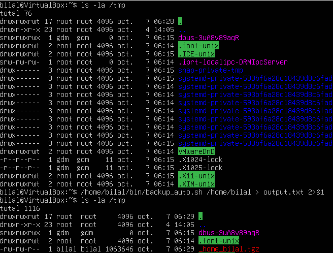

# Script pour sauvegarde quotidienne automatisée

Ce script shell a été développé à la suite de la lecture du livre _"Ubuntu - Administration d'un système Linux"_ des éditions ENI. Il permet d'automatiser la sauvegarde d’un répertoire donné, en conservant un historique de 7 jours. Les fichiers de sauvegarde sont compressés au format `.tgz`.


## Contexte

Le script répond à un exercice du livre qui demande de "mettre au point un shellscript de sauvegarde quotidienne d’un répertoire donné, conservant 7 jours d’historique. Le fichier résultat doit être compressé et la sauvegarde doit être lancée chaque jour à 19h." 


## Script

Shellscript "backup_auto.sh" :

```
#!/bin/bash

[ $# -eq 1 ] && [ -r $1 ] || { echo "Mauvais usage : $0 rep"; exit 1; }

tar -cvzf "/tmp/$(echo $1 | tr '/' '_').tgz" $1
```


Ajoutez ensuite la tâche à la crontab de l'utilisateur en utilisant la commande suivante :

`crontab -u bilal -e` 

*(le nom d'utilisateur ici est bilal)*


Ensuite, insérez la ligne de commande à la fin du fichier pour définir les paramètres de sauvegarde souhaitée.

`0 19 * * * /home/bilal/bin/backup_auto.sh /home/bilal`

*(`/home/bilal` est un répertoire arbitraire pris pour l'exemple)*


## Explication

```
#!/bin/bash

[ $# -eq 1 ] && [ -r $1 ] || { echo "Mauvais usage : $0 rep"; exit 1; }

tar -cvzf "/tmp/$(echo $1 | tr '/' '_').tgz" $1
```

La première ligne indique quel shell utiliser grâce au shebang (`#!`

La deuxième ligne vérifie que :

- Le nombre d'arguments (`$#`) est égal à 1 ET que le paramètre fourni est lisible.
- Sinon, elle affiche un message d'erreur et termine le script avec un code de sortie de 1.


## Exemple


Et la commande `tar` crée une archive compressée dans `/tmp`, en remplaçant les barres obliques (`/`) dans le nom du répertoire par des underscores (`_`) et en ajoutant l'extension `.tgz`.
